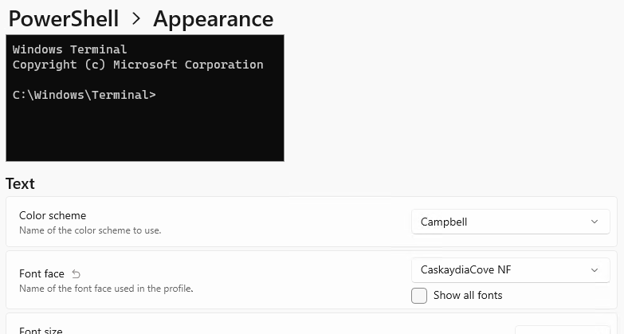

# Project Readme

## Configuring Windows Terminal

During the course, we use Windows Terminal to run the application, displaying an emoji character. It's not crucial to follow along with this step. If you do wish to do so, you must configure your terminal to support displaying Unicode characters. Here are the steps I used on Windows 10.

1. Install Windows Terminal from the [Microsoft Store ](https://apps.microsoft.com/store/detail/windows-terminal/9N0DX20HK701)
2. Install Powershell from the [Microsoft Store](https://apps.microsoft.com/store/detail/powershell/9MZ1SNWT0N5D)
3. Download and install [Caskaydia Cove Nerd Font](https://github.com/ryanoasis/nerd-fonts/releases/tag/v2.1.0)
4. Configure the Powershell appearance settings in Windows Terminal to use the "Caskaydia NF" font.

The Powershell version available from the Microsoft Store defaults to use UTF8 encoding and therefore supports emojis rendered to the console from .NET applications. 